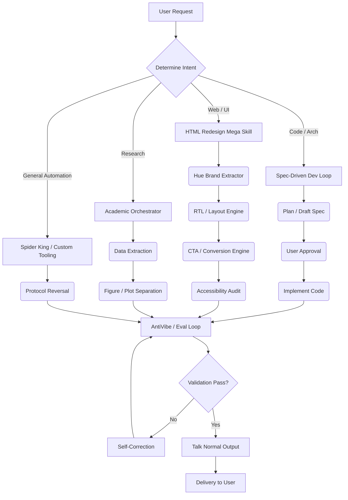

# WORKFLOW MAP

This map illustrates how the newly integrated skills interconnect during a standard agentic task.

## Key Workflow Stages:
1. **Intake:** The agent receives the prompt and immediately applies `Talk Normal` constraints to its internal monologues.
2. **Routing:** The request is categorized to trigger the correct mega-skill.
3. **Execution:** Specialized routines (e.g., RTL formatting, protocol reversal) are applied.
4. **Validation:** The `AntiVibe` evaluation loop ensures the agent hasn't hallucinated or skipped constraints (e.g., verifying exactly ONE `<h1>`).
5. **Delivery:** Concise, exact delivery of the required assets.
